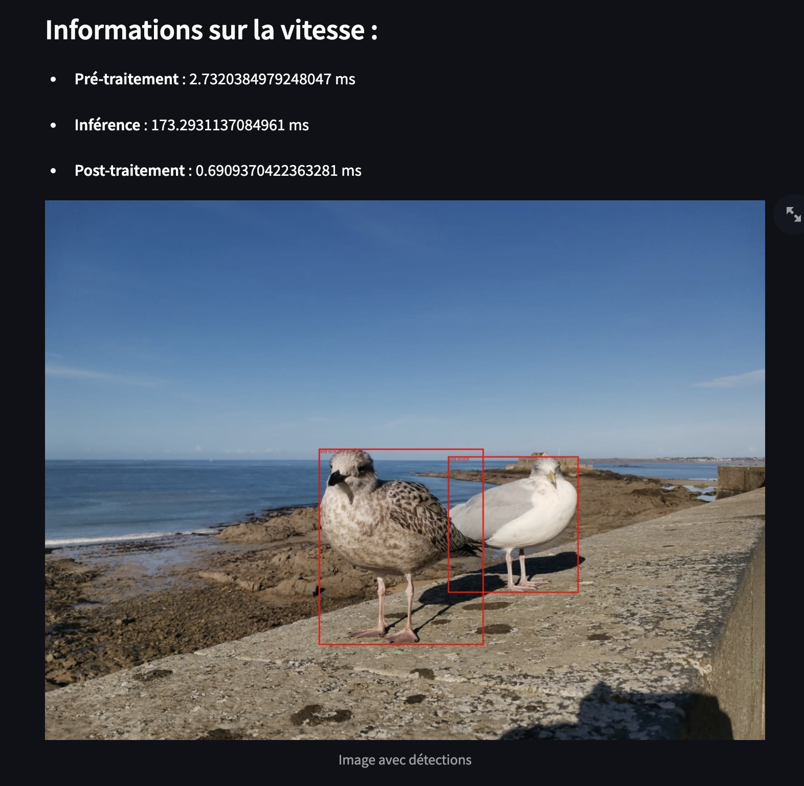
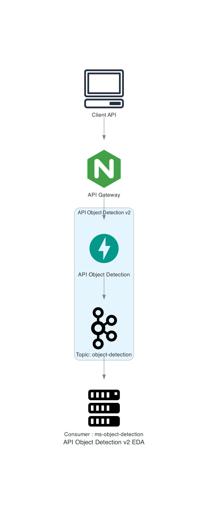

# api-object-detection

références : https://www.ultralytics.com/fr/yolo
models: https://docs.ultralytics.com/models/

Cette API a pour but de faire de la détection d'objet dans une image. Elle va analyser l'image en utilisant un modèle 
basé sur Yolo et retourner un JSON avec les informations des objets détectés.  

Les boxes sont les coordonnées des objets détectés dans l'image.  

```
{
  "shape": [
    1200,
    1600,
    3
  ],
  "speed": {
    "preprocess": 2.7320384979248047,
    "inference": 173.2931137084961,
    "postprocess": 0.6909370422363281
  },
  "boxes": [
    {
      "xmin": 895.2835083007812,
      "ymin": 568.5946044921875,
      "xmax": 1184.856689453125,
      "ymax": 872.2315063476562,
      "confidence": 0.9305744767189026,
      "predicted_class": 14,
      "name": "bird"
    },
    {
      "xmin": 607.6286010742188,
      "ymin": 551.6298828125,
      "xmax": 974.4431762695312,
      "ymax": 988.2098388671875,
      "confidence": 0.9220243692398071,
      "predicted_class": 14,
      "name": "bird"
    }
  ],
  "classes": {
    "14": {
      "class_name": "bird",
      "count": 2
    }
  }
}
```



Les données ne sont pas renvoyées directement. 
Lors de la prédiction un UUID est renvoyé pour permettre ultérieurement de récupérer les données.
Un topic Kafka est utilisé pour désynchroniser la récupération des données.


